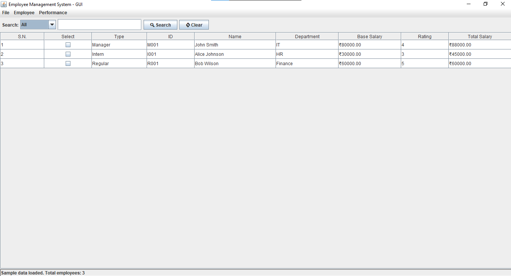

# Employee Management System - Documentation

## 📋 Project Overview

A Java-based Employee Management System with both GUI and Command Line interfaces for managing employee data, performance, and file operations.

## 🏗️ Project Structure

```
EmployeeManagementSystem/
├── src/
│   ├── employee/
│   │   ├── Employee.java              # Abstract base class
│   │   ├── Manager.java               # Manager subclass (10% bonus)
│   │   ├── Intern.java                # Intern subclass (50% bonus)
│   │   ├── Regular.java               # Regular subclass (no bonus)
│   │   ├── EmployeeManagementSystem.java  # Main class with CUI
│   │   ├── EmployeeManagementGUI.java     # GUI interface
│   │   ├── FileHandler.java          # File I/O operations
│   │   ├── AddEmployeeDialog.java     # Add employee dialog
│   │   ├── UpdateEmployeeDialog.java  # Update employee dialog
│   │   ├── SearchEmployeeDialog.java  # Search dialog (legacy)
│   │   └── PerformanceDialog.java     # Performance management
│   └── module-info.java              # Java module configuration
├── bin/                              # Compiled classes
├── employee details                  # Sample data file
├── employee_data                     # Sample data file
└── README.md
```

## 🎯 Core Features

### **Employee Types & Inheritance**

- **Employee** (Abstract): Base class with common attributes
- **Manager**: Gets 10% automatic bonus
- **Intern**: Gets 50% automatic bonus
- **Regular**: No automatic bonus

### **Key Functionality**

- ✅ **CRUD Operations**: Create, Read, Update, Delete employees
- ✅ **File Management**: Load/Save CSV data
- ✅ **Performance Management**: Bonuses, fines, rating updates
- ✅ **Search & Filter**: Real-time table filtering
- ✅ **Dual Interface**: GUI and Command Line options

## 🖥️ GUI Interface

### **Main Window Layout**



### **Search Panel Features**

- **Search Types**: All, ID, Name, Department, Rating
- **Real-time Filtering**: Results update as you type
- **Clear Button**: Reset search and show all employees
- **Status Updates**: Shows number of results found

### **Table Features**

- **Serial Numbers**: Auto-incrementing row numbers
- **Checkbox Selection**: Select employees for actions
- **Sortable Columns**: Click headers to sort
- **Responsive Layout**: Adjustable column widths

## 🔧 Working Functions

### **Employee Management**

```java
// Add Employee
AddEmployeeDialog dialog = new AddEmployeeDialog(parent, employees);
// Validates input, checks for duplicate IDs, creates appropriate subclass

// Update Employee
UpdateEmployeeDialog dialog = new UpdateEmployeeDialog(parent, employee);
// Pre-fills current data, allows partial updates

// Delete Employee
deleteSelectedEmployee(); // Shows confirmation dialog
```

### **Search & Filter**

```java
performSearch(searchType, searchTerm);
// Filters employees based on selected criteria
// Updates table in real-time
// Shows result count in status bar
```

### **Performance Management**

```java
PerformanceDialog dialog = new PerformanceDialog(parent, employee);
// Shows current salary breakdown
// Applies automatic bonuses
// Allows manual fines
// Updates performance ratings
```

### **File Operations**

```java
FileHandler.loadEmployeesLinked(filename);  // Load from CSV
FileHandler.saveEmployeesLinked(filename, employees); // Save to CSV
FileHandler.saveQueryResults(results, filename); // Save search results
```

## 📊 Data Flow

### **Employee Creation**

1. User clicks "Add Employee"
2. Dialog validates input (ID uniqueness, rating 1-5)
3. Creates appropriate subclass (Manager/Intern/Regular)
4. Adds to employees list
5. Refreshes table display

### **Search Process**

1. User types in search field
2. DocumentListener triggers search
3. Filters employees based on criteria
4. Updates table with results
5. Shows status message with count

### **Performance Management**

1. User selects employee via checkbox
2. Clicks "Performance" button
3. Shows current salary + automatic bonus
4. User can apply fines or update ratings
5. Table refreshes with new data

## 🎨 GUI Components

### **Dialogs**

- **AddEmployeeDialog**: Form with validation
- **UpdateEmployeeDialog**: Pre-filled form for editing
- **PerformanceDialog**: Salary management interface

### **Table Management**

- **DefaultTableModel**: Custom model with checkbox support
- **Cell Renderers**: Proper display of different data types
- **Selection Handling**: Checkbox-based selection system

### **Event Handling**

- **Action Listeners**: Button clicks and menu selections
- **Document Listeners**: Real-time search as user types
- **Mouse Listeners**: Table interactions

## 🔄 Interface Choice

### **Startup Process**

1. Program launches
2. Shows interface selection menu:
   - Option 1: GUI (Graphical User Interface)
   - Option 2: CUI (Command Line Interface)
3. Launches selected interface

### **GUI Benefits**

- Visual table with search
- Intuitive button layout
- Real-time filtering
- Professional appearance

### **CUI Benefits**

- Lightweight operation
- Script-friendly
- No GUI dependencies
- Traditional menu system

## 📁 File Format

### **CSV Structure**

```csv
Type,ID,Name,Department,Salary,Rating
Manager,M001,John Smith,IT,80000.0,4
Intern,I001,Alice Johnson,HR,30000.0,3
Regular,R001,Bob Wilson,Finance,60000.0,5
```

## 🚀 Usage Instructions

### **Adding Employees**

1. Click "➕ Add Employee"
2. Select type (Manager/Intern/Regular)
3. Fill required fields
4. Click "Add Employee"

### **Searching**

1. Select search type from dropdown
2. Type search term in field
3. Results filter automatically
4. Click "🔄 Clear" to reset

### **Updating/Deleting**

1. Check employee checkbox
2. Click "✏️ Update" or "🗑️ Delete"
3. Follow dialog prompts

### **Performance Management**

1. Select employee checkbox
2. Click "📊 Performance"
3. View salary breakdown
4. Apply bonuses/fines as needed

## 🛠️ Technical Details

### **Java Modules**

- Uses `java.desktop` for GUI components
- Modular structure for better organization
- Clean separation of concerns

### **Design Patterns**

- **Inheritance**: Employee hierarchy
- **Polymorphism**: `calculateSalary()` method
- **Encapsulation**: Private fields with getters/setters
- **Abstract Classes**: Employee as base class

### **Data Structures**

- `LinkedList<Employee>`: Dynamic employee storage
- `DefaultTableModel`: Table data management
- `HashMap`: Efficient data lookups

---

**Built with Java Swing, featuring modern GUI design and comprehensive employee management capabilities.**
